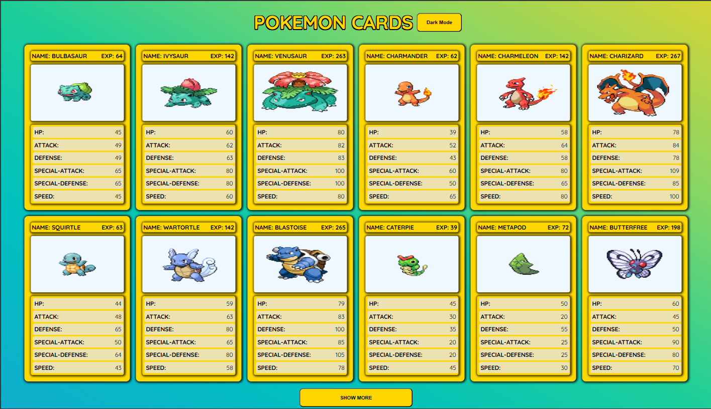
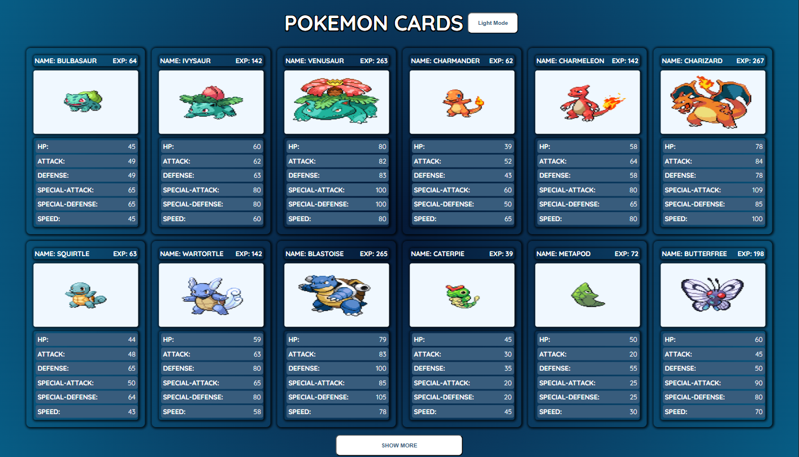
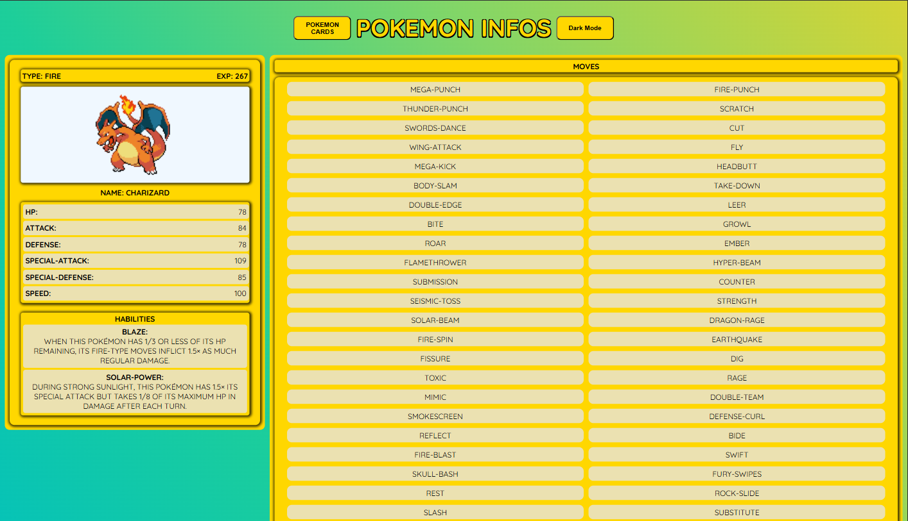
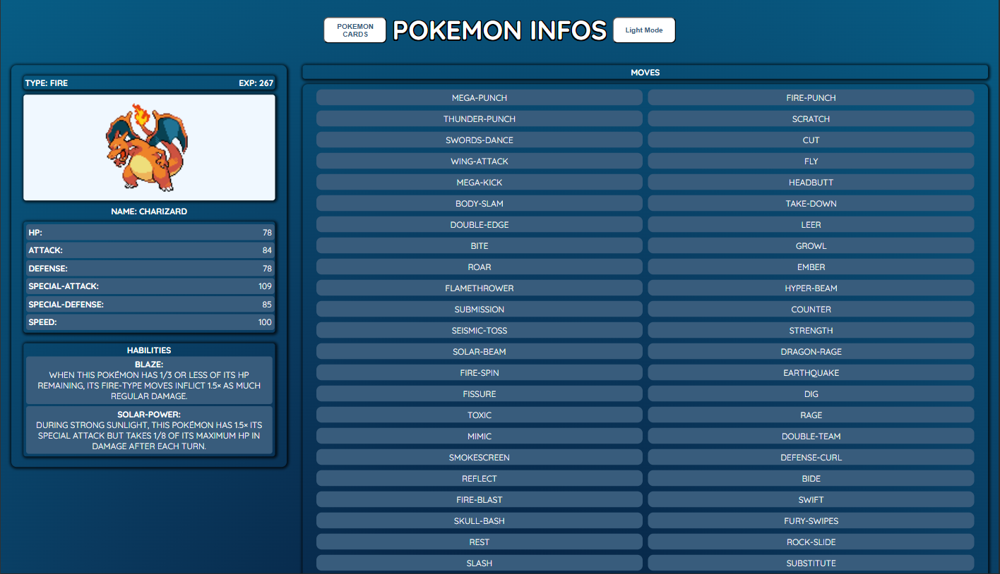

# Pokemon Cards 

# Aplicação com o tema LIGHT:



# Aplicação com o tema DARK:




# Propósito da aplicação
- O propósito da aplicação é o tratamento de dados vindos de uma API da melhor forma possível conciliando performance na requisição desses dados e a experiência do usuário ao navegar pela aplicação.

# Funcionalidades
- A aplicação traz dados de uma API sobre pokemons, dando ao usuário uma gama de dados de cada pokemon ao acessar a aplicação e a capacidade de trazer uma maior quantidade de pokemons ao clicar no botão SHOW
MORE. Ao clicar em um dos componentes de cada pokemon o usuário será redirecionado para uma página com dados mais específicos do pokemon clicado além da capacidade de trocar o tema da aplicação entre LIGHT e DARK MODE.

# Ferramentas utilizadas

# 
- REACT: Foi útilizado como framework o REACT por suas três principais características que são a componentização, a single page aplication, e o JSX. A componentização sendo utilizada
para renderizar as cartas pokemons utilizando menos código e facilidade de manutenção, a sigle page aplication para melhorar a experiência do usuário ao navegar entre a página das cartas e a página 
de cada pokemon e o JSX para a utilização de código HTML com JavaScript de maneira mais simples.
Foi utilizado o useState e o useContext do próprio REACT, o useStaste para gerenciar a quantidade de pokemons que seriam buscados ao acessar a aplicação e a quantidade a mais que seriam buscados ao 
clicar no botão de carregar mais e o useContext para criar um contexto de darkmode passando propriedades de estilo apenas entre componentes que utilizarão esses estilos. 
Também foram utilizadas bibliotecas externas como:


# 
- REACT ROUTER: Ultilizado para gerenciar as rotas dentro da aplicação durante a navegação do usuário entre as páginas.

# 
- STYLED COMPONENTS: utilizado para a estilização dos componentes melhorando a performance da aplicação carregando apenas os estilos de CSS que estão sendo exibidos no momento
e facilitanto a manutenção já que o código de cada parte do componente fica separado.

# 
- Axios: Utilizado para fazer as requisições dos dados da API, por ser mais simples no seu uso e mais robusto para o tratamento das requisições como requisições mais simples
e com menos código, resposta JSON automática e tratamento de erros automaticamente.

# 
- REACT QUERY: Utilizado para fazer a manipulação dos dados trazidos da API de maneira mais simples, como foi utilizado na aplicação para a manipulação dos dados trazidos e o gerenciamento de estado de erros e de
carregamento dos dados.

# Passos para a execução da aplicação
- Ler a documentação da API e planejar o seu uso de maneira mais performática.
- Desmembrar os desafios do uso da API em pequenas partes para que fique mais simples o seu uso como o fato de por ser uma base de dados muito grandes não se tem 
todos os dados do pokemon com apenas uma request.
- Separar bem as resposabilidades de cada parte da aplicação para ficar mais organizada e de fácil manutenção. 

## Instalações

Use o gerenciador de pacotes [NPM](https://www.npmjs.com/) para instalar as dependências e rodar a aplicação.


```bash
npm install react-router-dom
npm install styled-components
npm install @tanstack/react-query
npm install axios
```
## Licensa

[MIT](https://choosealicense.com/licenses/mit/)
